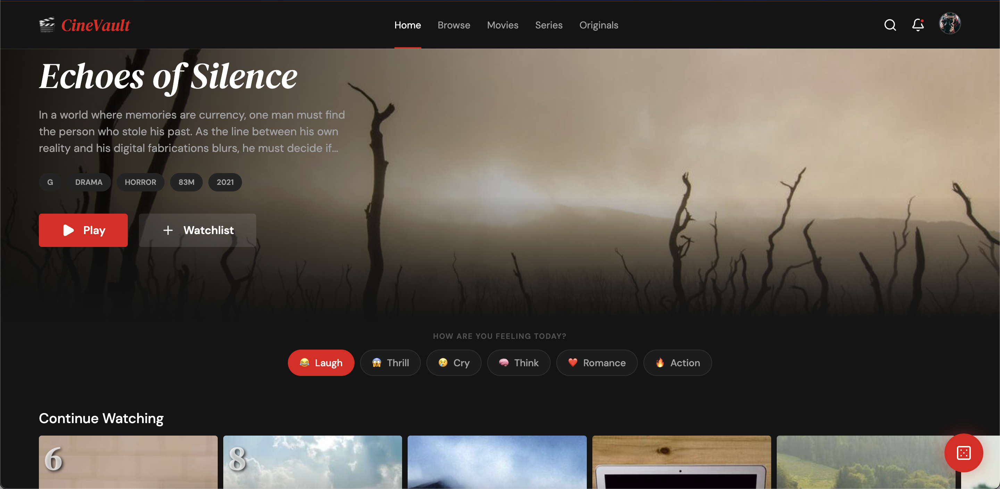

# 🎬 CineVault

> A cinematic streaming frontend that fuses Netflix's dark, content-first browsing architecture with Letterboxd's film-criticism community layer. Built to feel like a real platform — not a template.



---

## Overview

CineVault is a feature-rich, production-grade streaming frontend built with React 18. It gives users a full browsing, discovery, and social film experience — with deep watchlist management, community reviews, mood-based filtering, and a one-of-a-kind Random Watch roulette feature.

**Design DNA:** Netflix (dark surfaces, horizontal content rows, card hover expansion) × Letterboxd (editorial serif reviews, star ratings, community diary, film-criticism culture).

---

## Features

### 🏠 Home / Discovery
- **Hero Billboard** — full-bleed featured title with auto-rotate every 8 seconds, fade transition, and staggered content animation
- **Mood Picker** — filter the entire feed by emotional intent: 😂 Laugh · 😱 Thrill · 😢 Cry · 🧠 Think · ❤️ Romance · 🔥 Action
- **Continue Watching** — cards with SVG progress rings showing % completion and time remaining
- **Trending Now** — ranked 1–10 with large rank number overlays
- **Because You Watched** — algorithm row with "Why?" tooltip on hover
- **Top Picks from Friends** — avatar stack + star consensus chip
- **8 Genre Rows** — Action · Comedy · Thriller · Drama · Horror · Sci-Fi · Documentary · Romance

### 🔀 Random Watch
- Floating red dice FAB (bottom-right, always visible)
- Click triggers a **slot-machine roulette** cycling through poster images at variable speeds, settling on a random title in 1.2s
- Pre-spin filters: genre, mood, max runtime slider, minimum rating
- Result card: poster + metadata + "Play Now" / "Spin Again" / "+ Watchlist" actions

### 🔍 Browse & Search
- Sticky filter bar: genre multi-select · year range dual slider · type toggle · language · min rating
- Grid view (5-column poster grid) and list view toggle
- Infinite scroll with `IntersectionObserver` — 40 items per load, shimmer skeleton loading states
- Active filter chips with dismiss and title count ("187 titles")
- Full-text search with **typeahead dropdown** (poster thumbnails inline)
- Tabbed results: All · Movies · Series · People · Users
- Recent searches + trending searches list

### 🎥 Title Detail
- Full-bleed backdrop header (65vh) with gradient overlay
- Action bar: Play · Trailer · + My List · Like · Share
- **Letterboxd Review Panel** — aggregate star rating, rating histogram (Recharts), top 3 critic reviews with spoiler blur toggle
- Write-a-review modal with interactive star picker and spoiler toggle
- Community activity: "X friends watched this"
- Watchlist categorizer — assign to custom lists (e.g. "Horror Marathon", "Date Night")
- Similar Titles row + More from Director row

### 📋 Watchlist Manager
- Sidebar with default lists (Want to Watch · Watching · Watched) + user-created lists
- **Drag-and-drop reordering** via `@dnd-kit/core`
- Create list modal: name, description, public/private toggle, cover image presets
- Stats card: total runtime formatted as "X days Y hours" · genre donut chart · completion % bar

### 👤 Profile & Diary
- Stats dashboard: films watched · total runtime · avg rating · lists created
- **Watch Diary** — calendar month grid with poster thumbnails on watched dates
- Achievements shelf: "Century Club" · "Horror Fan" · "Film Noir Devotee" · "Marathon Runner" · "Critic's Eye"
- Public lists grid, recent reviews feed, follower/following counts

---

## Tech Stack

| Category | Technology |
|---|---|
| Framework | React 18 + Vite |
| Routing | React Router v6 |
| State Management | Zustand |
| Styling | CSS Modules + CSS Custom Properties |
| Charts | Recharts (donut chart, rating histogram) |
| Drag and Drop | @dnd-kit/core |
| Icons | Lucide React |
| Fonts | DM Serif Display · DM Sans (Google Fonts) |
| Images | Picsum Photos (seeded, consistent) |

---

## Project Structure

```
cinevault/
├── public/
├── src/
│   ├── assets/
│   ├── components/
│   │   ├── NavBar.jsx
│   │   ├── NavBar.module.css
│   │   ├── ContentCard.jsx
│   │   ├── ContentCard.module.css
│   │   ├── HorizontalRow.jsx
│   │   ├── HorizontalRow.module.css
│   │   ├── StarRating.jsx
│   │   ├── ReviewCard.jsx
│   │   ├── ReviewCard.module.css
│   │   ├── RandomWatchFAB.jsx
│   │   ├── RandomWatchModal.jsx
│   │   ├── RandomWatchModal.module.css
│   │   ├── MoodPicker.jsx
│   │   ├── MoodPicker.module.css
│   │   └── Skeleton.jsx
│   ├── pages/
│   │   ├── HomePage.jsx
│   │   ├── BrowsePage.jsx
│   │   ├── TitleDetailPage.jsx
│   │   ├── WatchlistPage.jsx
│   │   ├── SearchPage.jsx
│   │   └── ProfilePage.jsx
│   ├── store/
│   │   └── useStore.js
│   ├── data/
│   │   └── mockData.js
│   ├── styles/
│   │   └── global.css
│   ├── App.jsx
│   └── main.jsx
├── index.html
├── vite.config.js
├── package.json
└── README.md
```

---

## Getting Started

### Prerequisites

- Node.js 18+
- npm or yarn

### Installation

```bash
# Clone the repository
git clone https://github.com/yourhandle/cinevault.git
cd cinevault

# Install dependencies
npm install

# Start the development server
npm run dev
```

Open [http://localhost:5173](http://localhost:5173) in your browser.

### Build for Production

```bash
npm run build
npm run preview
```

---

## Routes

| Path | Page |
|---|---|
| `/` | Home — hero, mood picker, content rows |
| `/browse` | Browse — filtered catalogue, grid/list toggle |
| `/title/:id` | Title Detail — reviews, watchlist, similar titles |
| `/watchlist` | Watchlist Manager — lists, drag-and-drop, stats |
| `/search` | Search — typeahead, tabbed results |
| `/profile/:username` | Profile — diary, stats, achievements, reviews |

---

## Design System

### Color Tokens

| Token | Value | Usage |
|---|---|---|
| `--bg-base` | `#141414` | Page background |
| `--bg-surface` | `#1C1C1C` | Cards, modals, panels |
| `--bg-elevated` | `#242424` | Hover states, tooltips |
| `--brand-red` | `#E50914` | CTAs, active nav, FAB |
| `--brand-red-dark` | `#B81D24` | Button hover/pressed |
| `--accent-cyan` | `#00B4D8` | Links, "See all", usernames |
| `--accent-amber` | `#F39C12` | Star ratings |
| `--accent-green` | `#2ECC71` | Positive sentiment |
| `--text-primary` | `#FFFFFF` | Headlines, titles |
| `--text-secondary` | `#A3A3A3` | Body copy, metadata |
| `--text-tertiary` | `#545454` | Dividers, placeholders |

### Typography

| Role | Size | Weight | Font |
|---|---|---|---|
| Hero title | 52px | 400 | DM Serif Display |
| Section header | 20px | 500 | DM Sans |
| Card title | 14px | 500 | DM Sans |
| Review body | 14px | 400 | DM Serif Display |
| Meta / badge | 12px | 400–600 | DM Sans |

### Key Interactions

- **Card hover** — `scale(1.07)` with shadow elevation, overlay fade, action buttons appear
- **Hero billboard** — auto-rotates every 8s, content stagger-animates in with `animation-delay`
- **Nav** — transparent at scroll=0, fills to `#141414` past 50px with 200ms ease
- **Modal entry** — `translateY(20px) → 0` + opacity fade, 240ms ease-out
- **Random Watch FAB** — dice shakes on click, triggers slot-machine roulette

---

## Mock Data

CineVault ships with 60 mock content items in `src/data/mockData.js` covering all genres, types, and states:

- 8+ items with `progress` values for the Continue Watching row
- 10 items with `trending` ranks (1–10)
- 3+ reviews per title with realistic film-critic voice
- Varied moods, genres, languages, and runtimes
- Poster images from `picsum.photos` seeded by content ID for consistency

No external API keys or network calls required.

---

## Zustand Store

```js
// Global state shape
{
  watchlist: [],           // Array of content IDs + list assignments
  currentUser: {},         // Username, avatar, stats
  activeMood: null,        // Filters home feed rows
  recentSearches: [],      // Persisted search history
  randomFilters: {         // State for Random Watch modal
    genre: [],
    mood: null,
    maxRuntime: 240,
    minRating: 0
  }
}
```

---

## Prompt Architecture

This project was designed using a two-prompt system:

- **Stitch Prompt** — Visual language extraction from Netflix + Letterboxd design references, component specs, color tokens, typography scale, and page-by-page layout plans. Formatted for the [Stitch](https://stitch.withgoogle.com) visual UI builder.
- **Anti-Gravity Prompt** — Exhaustive, zero-ambiguity build specification for direct code generation. Includes exact CSS variable definitions, component prop shapes, mock data schema, file structure, animation keyframes, responsive breakpoints, and a strict 17-step build sequence.

---

## Contributing

Pull requests are welcome. For significant changes, please open an issue first to discuss what you'd like to change.

1. Fork the repository
2. Create your feature branch (`git checkout -b feature/your-feature`)
3. Commit your changes (`git commit -m 'Add some feature'`)
4. Push to the branch (`git push origin feature/your-feature`)
5. Open a Pull Request

---

## License

MIT — free to use, modify, and distribute.

---

> *"The feeling of walking into an independent cinema at night. Dark, warm, curated, social."*
